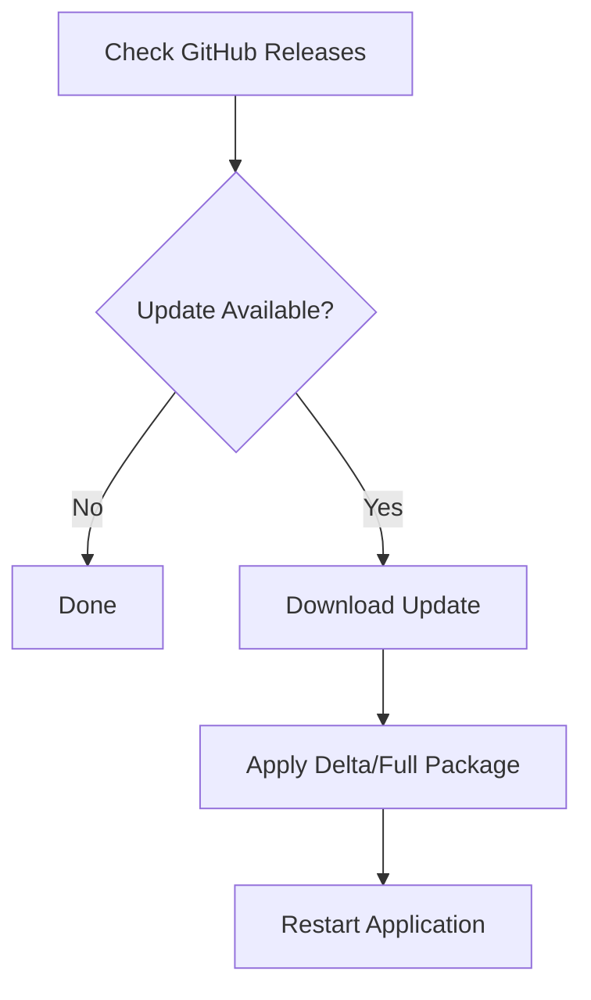

# Self-Update System

Synodic Client includes a self-update mechanism built on:

- **[Velopack](https://velopack.io/)** - Cross-platform installer and auto-update framework
- **GitHub Releases** - Distribution of update packages

## Update Channels

| Channel | Description | Release Type |
|---------|-------------|---------------|
| `stable` | Production releases only | Final releases (e.g., `1.0.0`) |
| `dev` | Development builds | Prereleases (e.g., `1.0.0.dev123`) |

## Update Workflow



1. **Check** - Query GitHub releases for newer versions via Velopack
2. **Download** - Fetch full or delta package
3. **Apply** - Velopack handles installation
4. **Restart** - Launch updated version

## Programmatic Usage

```python
from synodic_client.client import Client
from synodic_client.updater import UpdateChannel, UpdateConfig

# Initialize
client = Client()

# Configure for development channel
config = UpdateConfig(channel=UpdateChannel.DEVELOPMENT)
client.initialize_updater(config)

# Check for updates
info = client.check_for_update()
if info and info.available:
    print(f"Update available: {info.current_version} -> {info.latest_version}")
    
    # Download with progress
    def on_progress(percent: int) -> None:
        print(f"Downloading: {percent}%")
    
    if client.download_update(on_progress):
        # Apply and restart
        client.apply_update_on_exit(restart=True)
```

## Configuration

The `UpdateConfig` dataclass controls update behavior:

```python
@dataclass
class UpdateConfig:
    # GitHub repository URL for Velopack to discover releases
    repo_url: str = 'https://github.com/synodic/synodic-client'

    # Channel determines whether to use dev or stable releases
    channel: UpdateChannel = UpdateChannel.STABLE

    @property
    def channel_name(self) -> str:
        """Get the channel name for Velopack."""
        return 'dev' if self.channel == UpdateChannel.DEVELOPMENT else 'stable'
```

## GitHub Releases Structure

Velopack packages are published to GitHub Releases with the following structure:

| Platform | Files |
|----------|-------|
| Windows | `synodic-Setup.exe`, `synodic-{version}-full.nupkg` |
| Linux | `synodic.AppImage` |
| macOS | `synodic.app` (packaged) |

Velopack automatically manages `releases.{channel}.json` files for update discovery.
