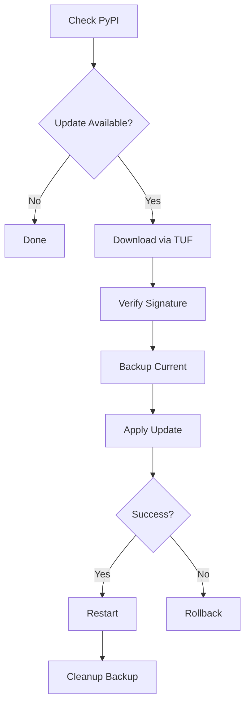

# Self-Update System

Synodic Client includes a secure self-update mechanism built on:

- **[TUF (The Update Framework)](https://theupdateframework.io/)** - Cryptographic verification of update artifacts
- **[porringer](https://www.github.com/synodic/porringer)** - Version checking via PyPI and download management

## Update Channels

| Channel | Description | PyPI Versions |
|---------|-------------|---------------|
| `STABLE` | Production releases only | Final releases (e.g., `1.0.0`) |
| `DEVELOPMENT` | Includes prereleases | All versions (e.g., `1.0.0.dev1`) |

The channel is automatically selected based on how the application is running:

- **Frozen executable** (PyInstaller): Uses `STABLE` channel
- **Running from source**: Uses `DEVELOPMENT` channel

## Update Workflow



1. **Check** - Query PyPI for newer versions
2. **Download** - Fetch artifact with TUF verification
3. **Backup** - Create backup of current executable
4. **Apply** - Replace executable with new version
5. **Restart** - Spawn new process and exit
6. **Cleanup** - Remove backup after successful verification

If an update fails to apply, the system automatically offers rollback to the previous version.

## Programmatic Usage

```python
from porringer.api import API, APIParameters
from porringer.schema import LocalConfiguration

from synodic_client.client import Client
from synodic_client.updater import UpdateChannel, UpdateConfig

# Initialize
client = Client()
porringer = API(LocalConfiguration(), APIParameters(logger))

# Configure for development channel
config = UpdateConfig(channel=UpdateChannel.DEVELOPMENT)
client.initialize_updater(porringer, config)

# Check for updates
info = client.check_for_update()
if info and info.available:
    print(f"Update available: {info.current_version} -> {info.latest_version}")
    
    # Download and apply
    if client.download_update():
        if client.apply_update():
            client.restart_for_update()
```

## Configuration

The `UpdateConfig` dataclass controls update behavior:

```python
@dataclass
class UpdateConfig:
    # PyPI package name for version checks
    package_name: str = 'synodic_client'

    # TUF repository URL for secure artifact download
    tuf_repository_url: str = 'https://synodic.github.io/synodic-updates'

    # Channel determines whether to include prereleases
    channel: UpdateChannel = UpdateChannel.STABLE

    # Local paths for metadata, downloads, and backups
    metadata_dir: Path = Path.home() / '.synodic' / 'tuf_metadata'
    download_dir: Path = Path.home() / '.synodic' / 'downloads'
    backup_dir: Path = Path.home() / '.synodic' / 'backup'
```

## TUF Repository

The TUF repository is managed separately at [synodic/synodic-updates](https://github.com/synodic/synodic-updates) using [tuf-on-ci](https://github.com/theupdateframework/tuf-on-ci).

After initialization, copy the `root.json` from the published repository to `data/tuf_root.json` in this project for bundling with the executable.

### Target Naming Convention

Artifacts are named by platform:

| Platform | Target Name Pattern |
|----------|---------------------|
| Windows | `synodic-{version}-windows-x64.exe` |
| macOS | `synodic-{version}-macos-x64` |
| Linux | `synodic-{version}-linux-x64` |
